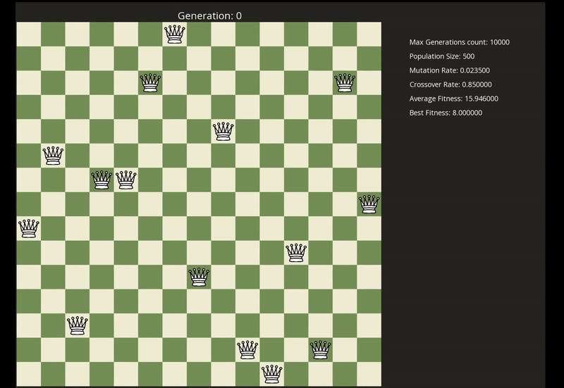

# Genetic algorithm to solve the N-Queens problem and its visualisation

## Overview
This program visualises the steps of genetic algorithm to solve N-Queens problem. You can visualise the positions of the queens on the chess board as well the curent mutation and crossover rate and many other stats.

## Showcase

## Features
- **Custom board size**: Change the board size to experiment with different board sizes
- **Stats about the progress**: Visualisation of each generation and its Fitness and Average Fitness rates
- **Interactive controls**:  You can control the visualisation with the following features:
  - **Adjust speed**: Change the speed of visualisation to match your preference
  - **Pause/Resume:** Pause the visualisation at any time
  - **Reset:** Reset the visualisation 

## Requirements
- You need to install the SFML library (SFML DEV) to build and run the program
  https://www.sfml-dev.org/download/ 
- After installing SFML, you may need to change the library path in Makefile accordingly (change the SFML_INCLUDE and SFML_LIB)

## Run the program
- Use **make** build the program
- run program using **./main arg1 arg2 \<arg3\>**
    - **arg1 )** Board size - whole number (the number should not be larger than 100 due to computational complexity, but you can experiment with larger numbers)
 
## Controls
- **Visualisation Speed:** Use `a` to slow down and `d` to speed up the visualisation
- **Pause/Play:** Use `spacebar` to pause and play the visualisation
- **Restart:** Use `r` to restart the visualisation

